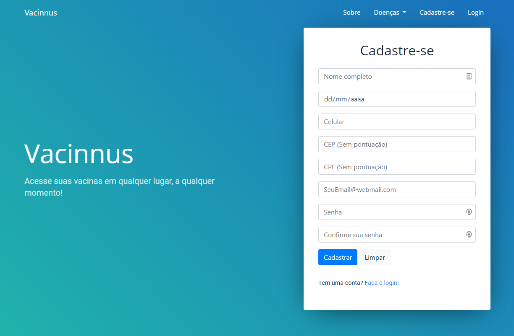
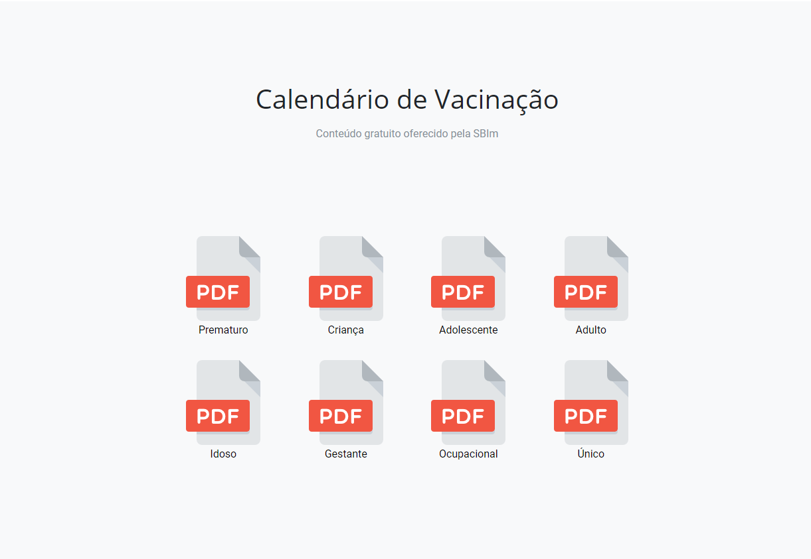
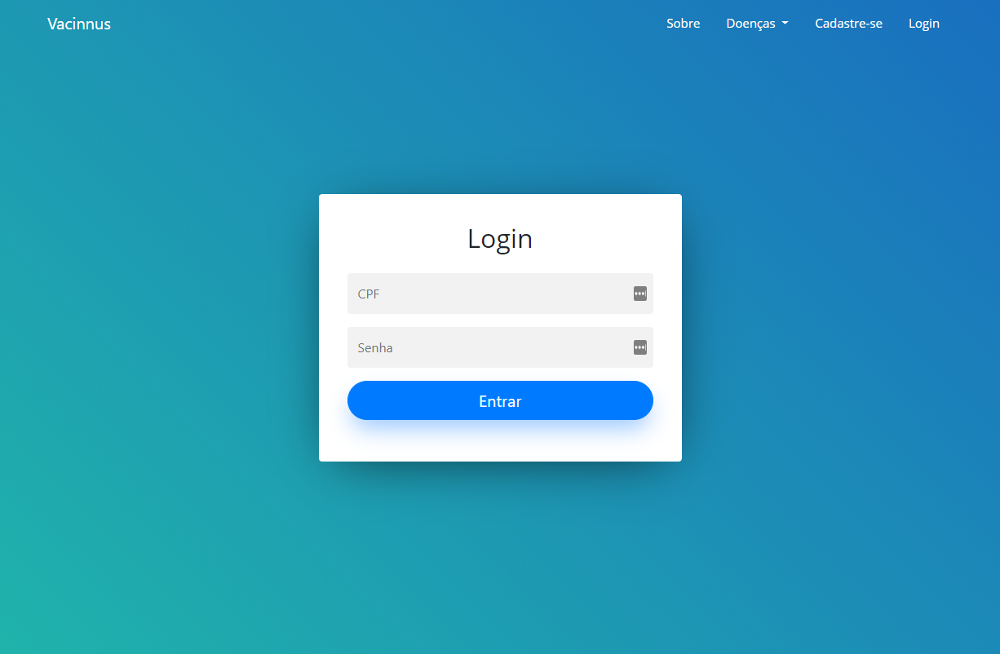
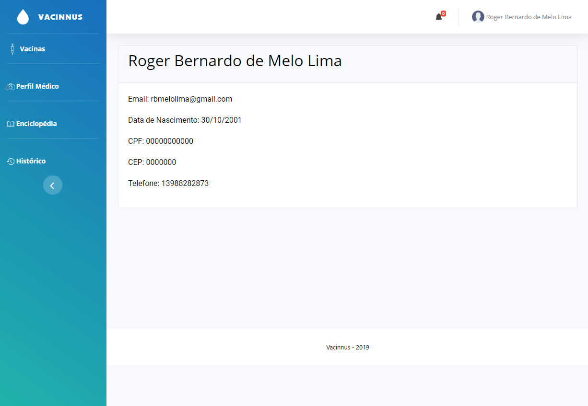
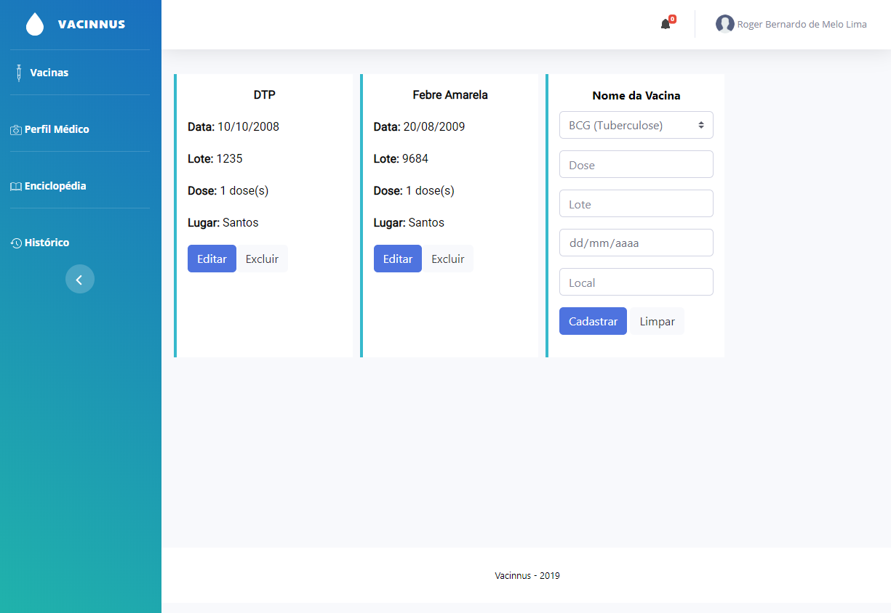

Vaccinus é uma aplicação web que procura deixar mais prático e seguro o controle das vacinas tomadas por um indivíduo, através de uma caderneta online, que pode ser ser acessada por qualquer dispositivo online conectado à internet. Esse é um projeto de TCC desenvolvido no ano de 2019 para o IFSP - Campus Cubatão.

> Naquela época, eu estava começando a entrar de fato no mundo do desenvolvimento web. Devido ao ínicio de carreira, me faltava uma bagagem de conhecimentos, por isso não achem estranho a estruturação dos arquivos, má nomeação das pastas e entre outros pontos relaconados ao amadorismo do código. Realmente, se faz necessário uma boa refatoração. 

## Começando
1. Tenha PHP e MySQL instalado em sua máquina

2. Execute esse script SQL para criação do banco de dados e suas tabelas:

```
CREATE SCHEMA `vacinnus` DEFAULT CHARACTER SET utf8;

use vacinnus;

create table pessoa(
nome varchar(100) not null,
datanasc date not null,
celular char(11) not null unique,
cep char(8) not null,
cpf char(11), 
email varchar(100) unique not null,
senha varchar(100) not null,
primary key(cpf)
);

create table vacina(
ID int primary key auto_increment,
nome varchar(60) not null,
lugar varchar(60) not null,
dia date not null,
codigo varchar(20),
dose int not null,
cpf char(11),
foreign key(cpf) references pessoa (cpf)
);

```

3. Entre no ``` localhost/Vaccinus/```

## Funcionalidades
* Login
* Cadastro de usuário
* Cadastro de vacinas
* Alteração de vacinas
* Remoção de vacinas
* Ler todas as vacinas

## Possíveis features
* Criação de um perfil médico pessoal
* Enciclopédia de remédios, doenças ou qualquer outra coisa
* Histórico de quando o usuário ficou doente, quais remédios tomou para se tratar, quais sintomas e etc. 
* Por meio de um scrapper, notificar o usuário a disponibilização de vacinas pelo governo. 

## Screenshots

### Página inicial


### Calendários de vacinação para download


### Página de login


### Página de perfil do usuário


### Página de gerenciamento das vacinas


## Templates utilizados
Página inicial e afins [Template Landing](https://uicookies.com/downloads/landing-free-onepage-bootstrap-4-template/).

Página administrativa [Template SB Admin 2](https://startbootstrap.com/themes/sb-admin-2/).

